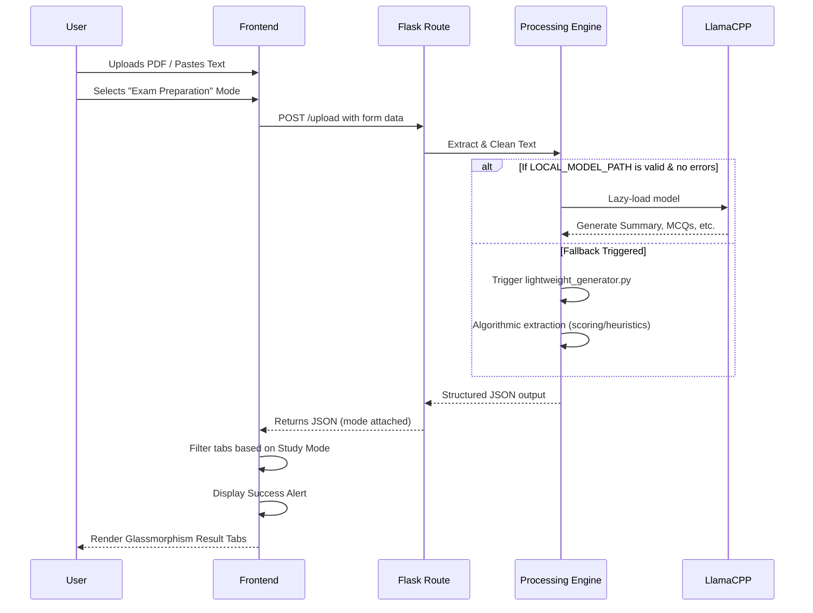
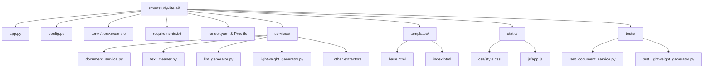

# Architecture Diagrams for SmartStudy Lite AI

## 1. Application Architecture

```mermaid
graph TD
    Client[Web Browser Client]
    
    subgraph Frontend [Frontend: HTML / CSS / Vanilla JS]
        UI[Glassmorphism UI]
        JS[app.js Logic]
        PDFGen[html2pdf.js]
        UI <--> JS
        JS --> PDFGen
    end

    subgraph Backend [Backend: Flask Framework]
        FlaskRouter[/upload]
        DLRoute[/download_revision]
        EnvConfig[.env Configuration]
        
        FlaskRouter <--> EnvConfig
    end

    subgraph Services [Smart Processing Engine]
        DocService[document_service.py\npypdf]
        CleanService[text_cleaner.py]
        
        subgraph Mode [Processing Logic]
            LLMGenerator[llm_generator.py\nGenerative AI]
            LightweightGen[lightweight_generator.py\nAlgorithmic Fallback]
        end
        
        FeatureExtractors[summarizer.py, keyword_extractor.py, \npoints_extractor.py, question_generator.py]
    end
    
    Client -- HTTP POST File/Text --> FlaskRouter
    JS -- Fetch API --> FlaskRouter
    
    FlaskRouter --> DocService
    DocService --> CleanService
    CleanService --> Mode
    
    LLMGenerator -- Try --> LocalModel((Local GGUF Model))
    LLMGenerator -- Fallback on Error --> LightweightGen
    
    LightweightGen --> FeatureExtractors
    
    Mode -- JSON Results --> FlaskRouter
    FlaskRouter -- JSON Response --> JS
```

## 2. Workflow Diagram



## 3. Folder Structure Diagram


